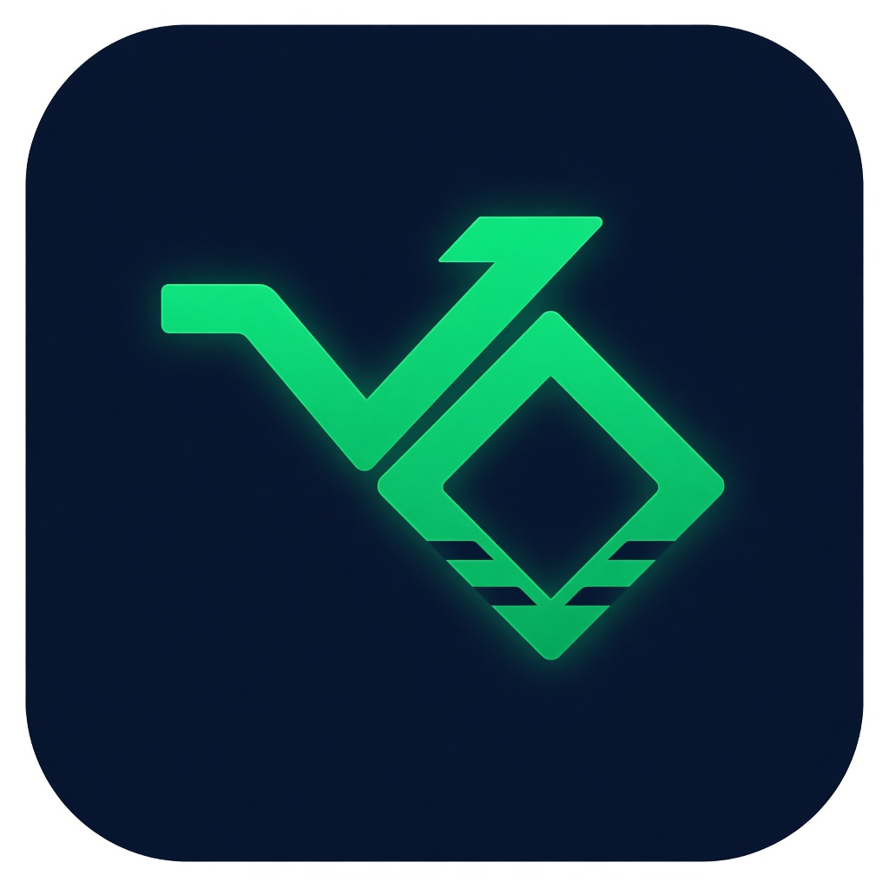
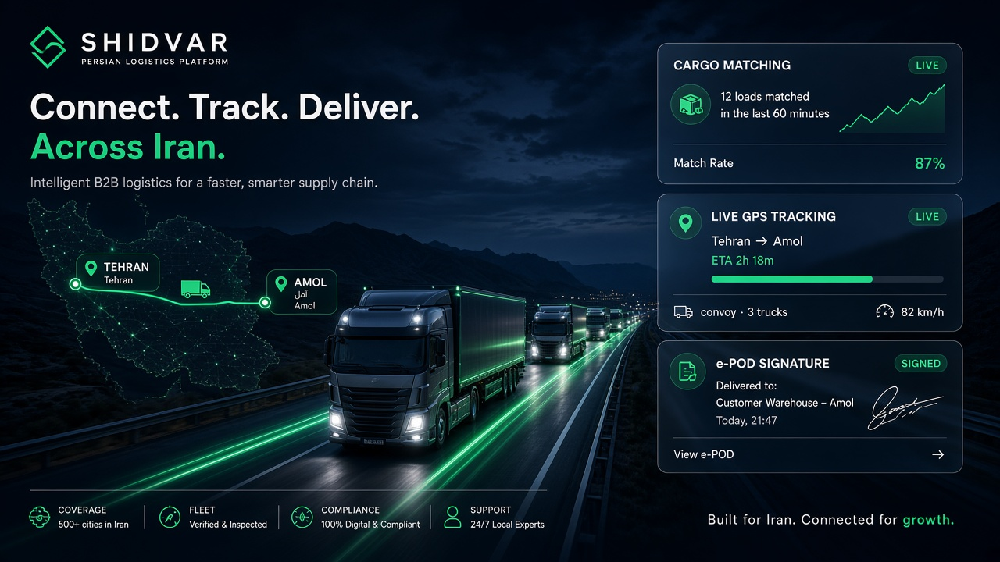
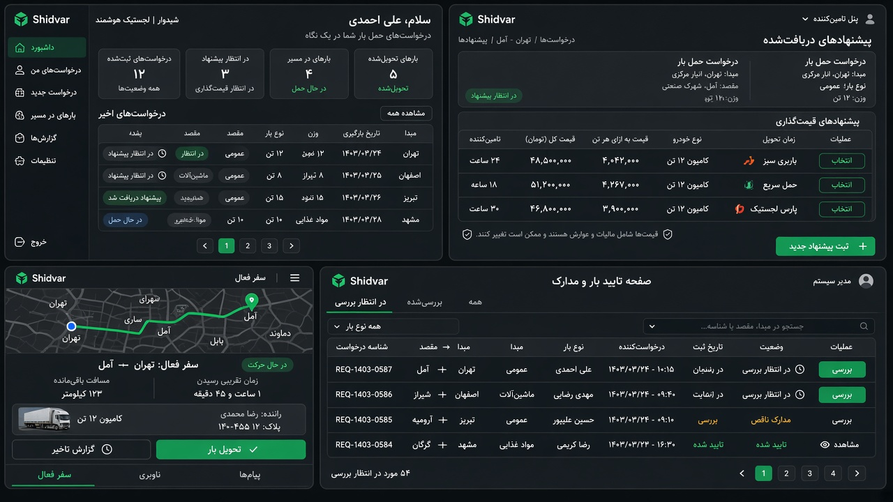
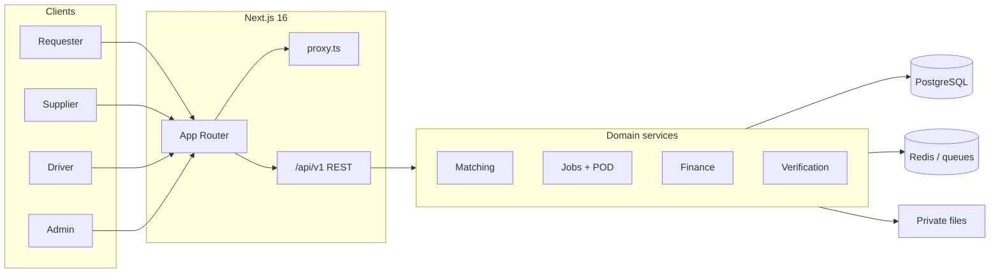
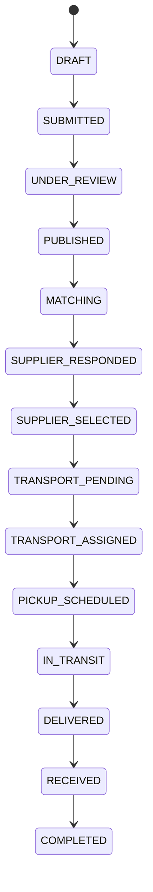

<p align="center">
  
</p>

<h1 align="center">شیدور · Shidvar</h1>

<p align="center">
  <strong>Persian-first B2B cargo matching and logistics platform</strong><br/>
  Approved distribution companies request city-to-city loads. Approved drivers accept or reject.<br/>
  Admin owns verification, invoices, live jobs, and the rule book.
</p>

<p align="center">
  <a href="https://github.com/omidram/shidvar"></a>
  
  
  
  
  
</p>

<p align="center">
  <a href="#-what-it-is">Product</a> ·
  <a href="#-portals">Portals</a> ·
  <a href="#-architecture">Architecture</a> ·
  <a href="#-quick-start">Quick start</a> ·
  <a href="#-demo-accounts">Demo accounts</a> ·
  <a href="#-windows-exe">Windows EXE</a>
</p>

---

<p align="center">
  
</p>

## What it is

Shidvar is **not** a client-only mock. Persistence is PostgreSQL. Authorization is enforced on the server. Status changes go through state machines. Documents (KYC, invoices, proof of delivery) stay in private storage.

| You get | How |
| --- | --- |
| Four portals | Requester · Supplier · Driver · Admin |
| Matching | Weighted supplier + driver scoring, not a dump of every row |
| Live ops | Tracking, POD photo + signature, invoices, disputes, tickets |
| Persian product UI | `fa` + RTL as the default locale |
| One deployable | Next.js App Router UI + versioned `/api/v1` |

<p align="center">
  
</p>

## Portals

| Portal | Who | Prefix | They do |
| --- | --- | --- | --- |
| **Requester** | Chain stores / purchasing | `/requester/*` | Create loads, accept offers, track, receive goods |
| **Supplier** | Supply companies | `/supplier/*` | Quote, confirm, hand off to transport |
| **Driver** | Individual drivers | `/driver/*` | Accept jobs, navigate, e-POD, wallet |
| **Admin** | Platform operators | `/admin/*` | KYC, publish requests, invoices, business rules |
| **Public** | Anyone | `/`, `/login`, `/register` | Marketing site + auth |

## Architecture

<p align="center">
  
</p>



### Commercial path



### Stack

| Layer | Choice |
| --- | --- |
| UI | Next.js 16 App Router, React 19, Tailwind, Radix |
| Forms | React Hook Form + Zod (same schemas on the server) |
| Data | PostgreSQL + Prisma |
| Jobs | Redis / BullMQ with an in-memory local fallback |
| Auth | Opaque session + rotating refresh in HttpOnly cookies |
| Maps | OSM-compatible geocode + Haversine |
| Pay | Provider interface (Zarinpal adapter in demo) |

Read these before changing domain behavior:

- [Architecture](docs/ARCHITECTURE.md)
- [Database](docs/DATABASE.md)
- [Business rules](docs/BUSINESS_RULES.md)
- [Security](docs/SECURITY.md)
- [API](docs/API.md)
- [Permissions](docs/PERMISSIONS.md)
- [Routes](docs/ROUTES.md)
- [Decisions](docs/DECISIONS.md)
- [Deployment](docs/DEPLOYMENT.md)
- [Testing](docs/TESTING.md)

## Quick start

**Requirements:** Node.js 20+, PostgreSQL on port `5433` (`npm run db:up` if Docker is not installed). Docker is optional.

```bash
cp .env.example .env
npm install
npm run db:up
```

Leave `db:up` running, then in another terminal:

```bash
npm run db:push
npm run db:seed
npm run dev
```

Open [http://localhost:5500](http://localhost:5500)

If Docker Desktop is installed you can use `docker compose up -d` instead of `npm run db:up`.

### Commands

| Command | Purpose |
| --- | --- |
| `npm run dev` | Next.js on port 5500 |
| `npm run worker` | Background jobs |
| `npm run build` | Production build |
| `npm run lint` | ESLint |
| `npm run typecheck` | `tsc --noEmit` |
| `npm run test` | Unit tests |
| `npm run test:e2e` | Playwright |
| `npm run db:up` | Local PostgreSQL on 5433 |
| `npm run db:push` | Apply Prisma schema |
| `npm run db:seed` | Demo seed (blocked in real production unless `SHIDVAR_DEMO=1`) |
| `npm run package:win` | Build a portable Windows EXE |

## Demo accounts

Local / demo only. Do not reuse these passwords anywhere real.

| Portal | Email | Password |
| --- | --- | --- |
| Admin | `admin@shidvar.local` | `DevAdmin!2026` |
| Requester | `buyer@alpha-stores.local` | `DevStore!2026` |
| Requester | `buyer@badr.local` | `DevStore!2026` |
| Requester | `buyer@chashni.local` | `DevStore!2026` |
| Requester | `buyer@mahram.local` | `DevStore!2026` |
| Supplier | `sales@pars-grain.local` | `DevSupplier!2026` |
| Driver | `ali.rezaei@fleet.local` | `DevDriver!2026` |
| Driver | `navid.karimi@fleet.local` | `DevDriver!2026` |

Phone login also works for the seeded Iranian numbers printed by the seed.

## Windows EXE

`npm run package:win` produces a single file:

`dist/Shidvar.exe`

Copy **only that file** to another Windows 10/11 x64 PC. Double-click it (do **not** use Run as administrator). It unpacks Node + a seeded Postgres cluster and opens `http://127.0.0.1:5500`.

If a previous run was elevated, delete `%LOCALAPPDATA%\ShidvarDesktop` and try again.

## Health

- `GET /health` — process up
- `GET /health/ready` — database reachable

## Repo layout

```text
src/app              portals + public site (App Router)
src/server           domain services, auth, jobs, HTTP router
src/components       design system + logistics visuals
prisma               schema + seed
docs                 architecture of record
scripts              db:up, Windows packager
docs/github          README art
```

<p align="center"><sub>Built as a production-shaped demo — server-enforced RBAC, not localStorage theatre.</sub></p>
