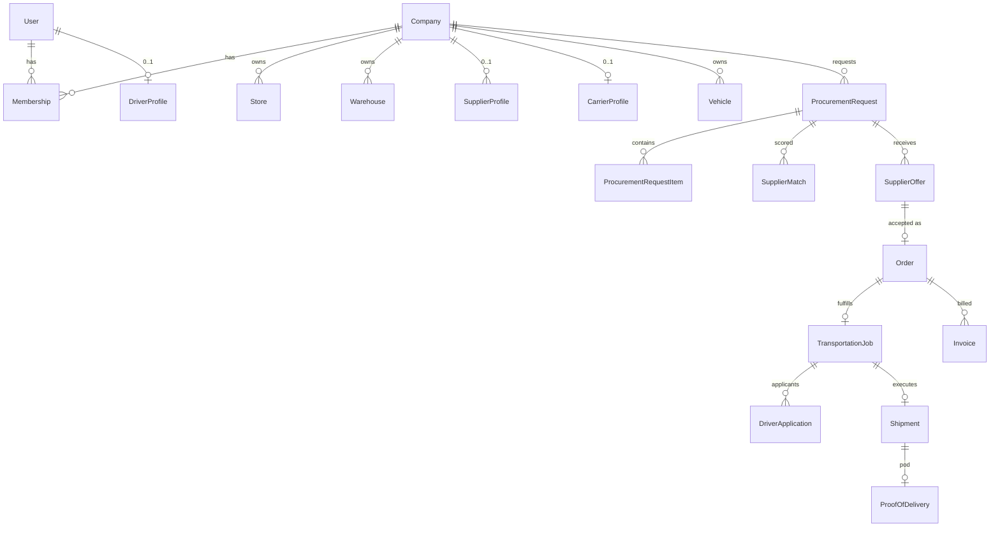

# Database design

PostgreSQL is the system of record. Prisma schema: `prisma/schema.prisma`.

Conventions:

- UUIDs for primary keys
- `createdAt` / `updatedAt` on mutable rows
- `deletedAt` for soft-deletable master data (users, companies, products, vehicles)
- Append-only: `AuditLog`, `LedgerTransaction`, `Notification` (no update of payload)
- Money: `Decimal(18, 4)` + `currencyCode`
- Quantities: `Decimal(18, 4)` + `unitCode`
- Optimistic concurrency: `version Int @default(1)` on requests, offers, jobs, orders
- All tenant tables indexed on `companyId` and status
- Unique business numbers via `NumberSequence`

## ERD (core commercial + logistics path)

## Identity and access

| Table | Purpose |
| --- | --- |
| `User` | Login identity. Email and phone unique when present. |
| `Session` | Hashed access token, expiry, IP, user agent, revokedAt |
| `RefreshToken` | Hashed refresh token, familyId, rotatedFromId, revokedAt |
| `CredentialChallenge` | Email/phone verify, password reset, 2FA pending (hashed) |
| `Role` | System or company-scoped role |
| `Permission` | `resource.action` code |
| `RolePermission` | M2M |
| `UserRole` | Assignment; `companyId` null = platform-wide |
| `Membership` | User belongs to company with status |

## Tenancy and geography

| Table | Purpose |
| --- | --- |
| `Company` | Tenant. Types: PLATFORM, REQUESTER, SUPPLIER, CARRIER |
| `Store` | Branch / store / purchasing node of a requester |
| `Warehouse` | Pickup or delivery site |
| `Address` | Structured address + optional lat/lng |
| `GeographicArea` | Hierarchical country → region → city → district → zone |
| `OperatingArea` | Polymorphic (supplier, driver, vehicle, request preference) |

## Catalog and supply

| Table | Purpose |
| --- | --- |
| `ProductCategory` | Tree |
| `Product` | Platform catalog SKU (optional link from supplier listings) |
| `Unit` | kg, ton, liter, … |
| `Currency` | ISO code, decimals, enabled |
| `SupplierProfile` | 1:1 company, verification, ratings cache |
| `SupplierProduct` | What they sell + indicative price |
| `SupplierCapacity` | Quantity available per product/category/window |
| `SupplierCertification` | Type, number, expiry, documentId |

## Fleet

| Table | Purpose |
| --- | --- |
| `CarrierProfile` | 1:1 company |
| `DriverProfile` | 1:1 user, optional carrier company, license, status |
| `Vehicle` | Capacity, dimensions, type, insurance expiry |
| `DriverVehicle` | Assignment |
| `VehicleEquipment` | Tail-lift, reefer, … |

## Procurement through delivery

| Table | Purpose |
| --- | --- |
| `ProcurementRequest` | Header + lifecycle |
| `ProcurementRequestItem` | Line quantities and quality/packaging notes |
| `RequestRequirement` | Certifications, vehicle hints, documents required |
| `SupplierMatch` | Score, breakdown, notifiedAt |
| `SupplierOffer` / `SupplierOfferItem` | Bid |
| `Order` / `OrderItem` | Accepted commercial agreement |
| `TransportationJob` | Logistics marketplace listing |
| `DriverMatch` | Driver scores |
| `DriverApplication` | Unique (jobId, driverId) |
| `Shipment` / `ShipmentItem` | Physical movement + partials |
| `ProofOfDelivery` | Photos meta, signature, GPS, receiver |
| `StatusHistory` | Generic timeline (entityType, entityId, from, to, actor) |
| `Cancellation` | Reason, penalty snapshot, review |

## Finance, docs, comms, quality

| Table | Purpose |
| --- | --- |
| `Invoice` / `InvoiceLine` | AR/AP documents |
| `Payment` | Recorded against invoice |
| `LedgerTransaction` | Immutable money movement |
| `CommissionRule` | Configurable fees |
| `CommissionEntry` | Calculated commission |
| `Settlement` | Payout batch |
| `Document` | Private file metadata |
| `Notification` / `NotificationPreference` | |
| `Conversation` / `ConversationParticipant` / `Message` | |
| `SupportTicket` / `TicketMessage` | |
| `Rating` | Unique (raterUserId, targetType, targetId, orderId) |
| `Dispute` / `DisputeMessage` | |
| `AuditLog` | Immutable |
| `BusinessRule` | Key/value configuration |
| `SystemSetting` | Non-rule config (branding, maintenance) |
| `NumberSequence` | PR/ORD/JOB/INV numbering |

## Indexes (minimum)

- `User(email)`, `User(phone)`, `User(status)`
- `Membership(companyId, userId)` unique
- `ProcurementRequest(companyId, status, createdAt)`
- `ProcurementRequest(status, requestedDeliveryDate)`
- `SupplierOffer(requestId, supplierCompanyId, status)`
- `TransportationJob(status, pickupAt)`, `TransportationJob(assignedDriverId)`
- `DriverApplication(jobId, driverId)` unique
- `Shipment(trackingNumber)` unique
- `Document(ownerCompanyId, entityType, entityId)`
- `AuditLog(entityType, entityId, createdAt)`
- `Notification(userId, readAt, createdAt)`
- `SupplierMatch(requestId, supplierCompanyId)` unique
- `Rating(orderId, raterUserId, targetType, targetId)` unique
- GiST/btree on `Address.latitude/longitude` for bounding-box prefilter; exact distance in app

## Constraints

- User must have email or phone
- Offer quantity between item min and max
- Application cannot exist for unapproved drivers (enforced in service + DB check via status)
- At most one `ACCEPTED` offer per request unless split-fulfillment rule is enabled (default: one winner; unique partial index)
- At most one assigned driver per job
- Soft-deleted rows excluded in default Prisma middleware

## Enums

Defined in Prisma and mirrored in `src/server/constants/enums.ts`. Status enums are listed with legal transitions in `docs/BUSINESS_RULES.md`.
